# Almost Grounded Unity

You can play the game by downloading the zip file from the [Releases](https://github.com/SonOfSkywalker/almost_grounded_unity/releases/tag/main) page.

## Screenshots

### In-Game Screenshots

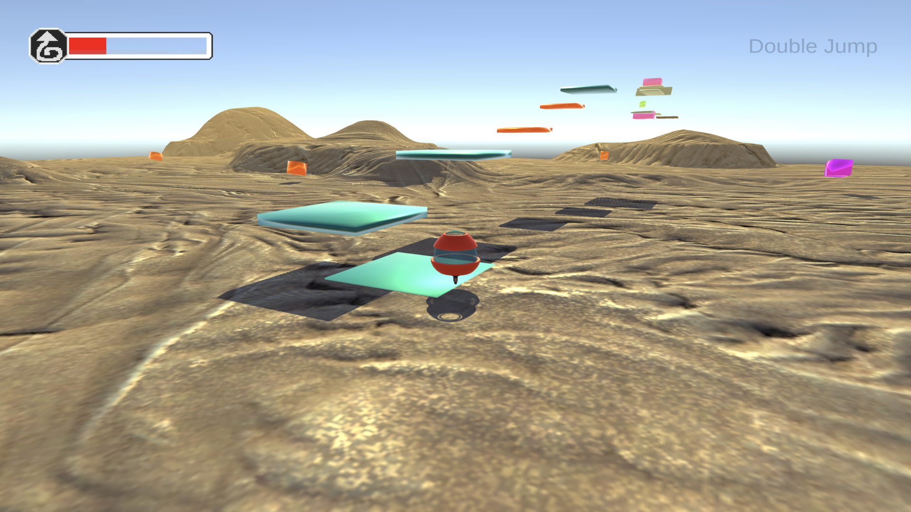
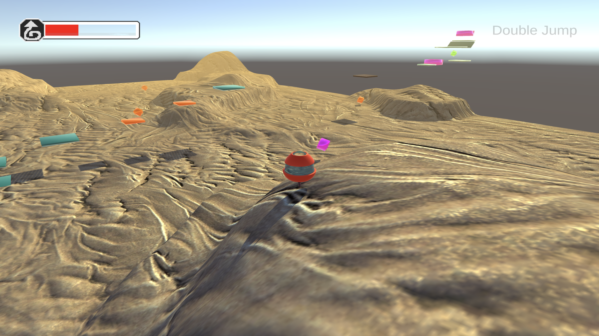
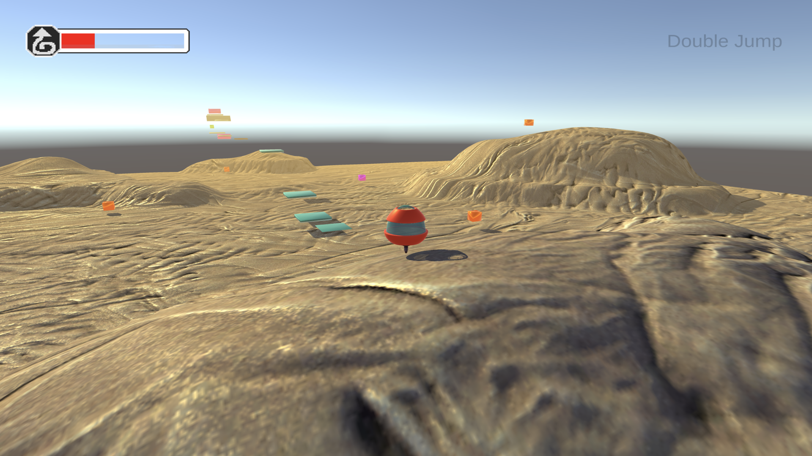
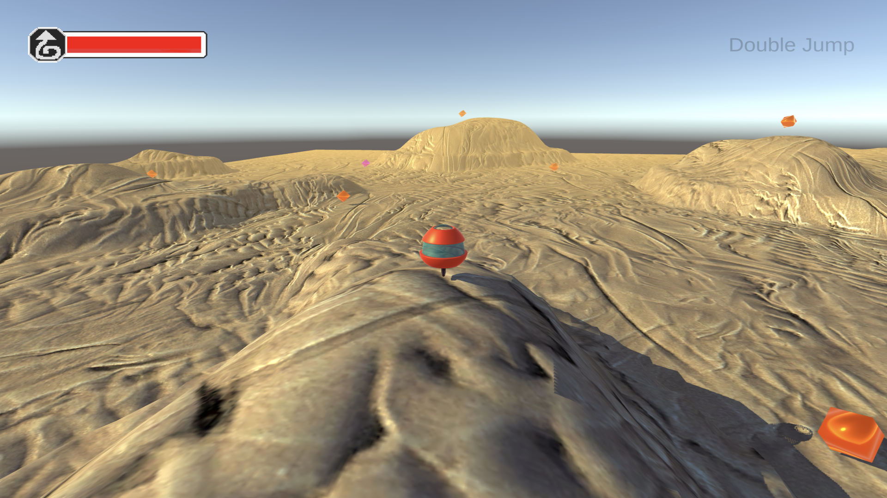
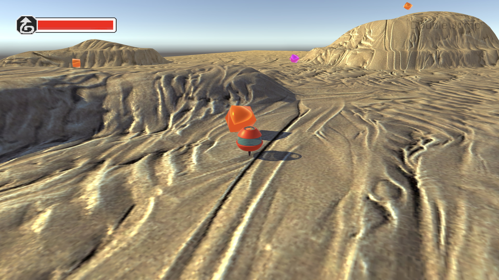
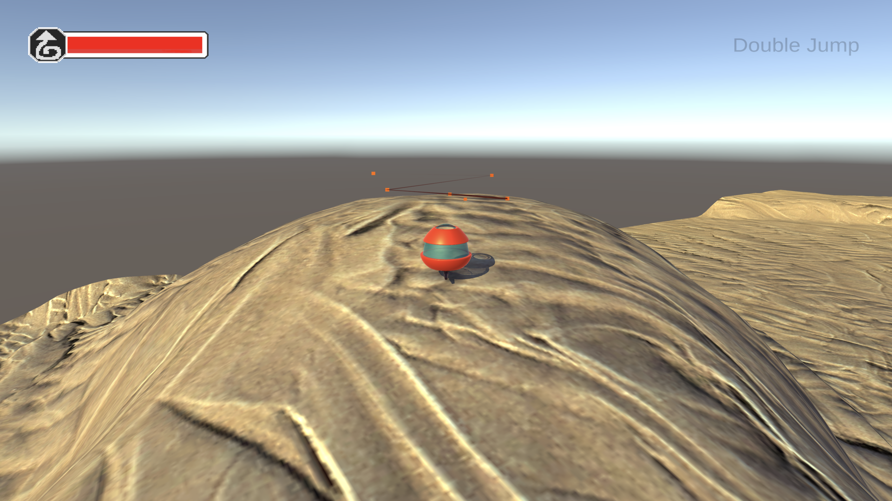
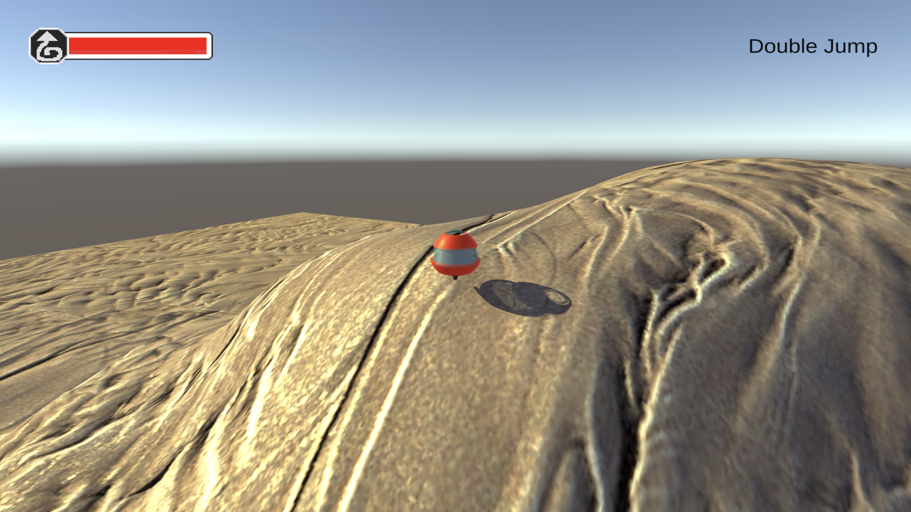

### Menu Screenshots

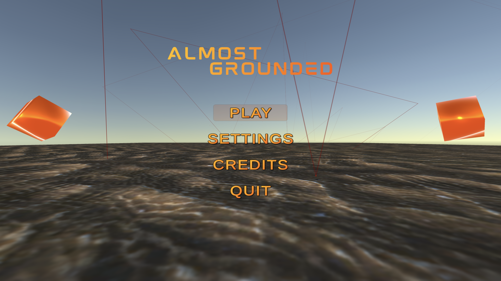
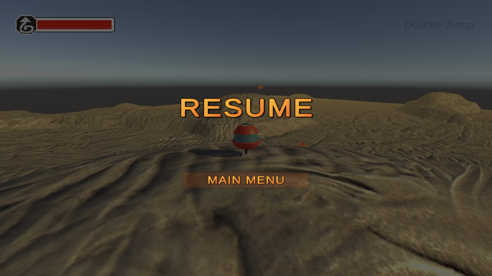
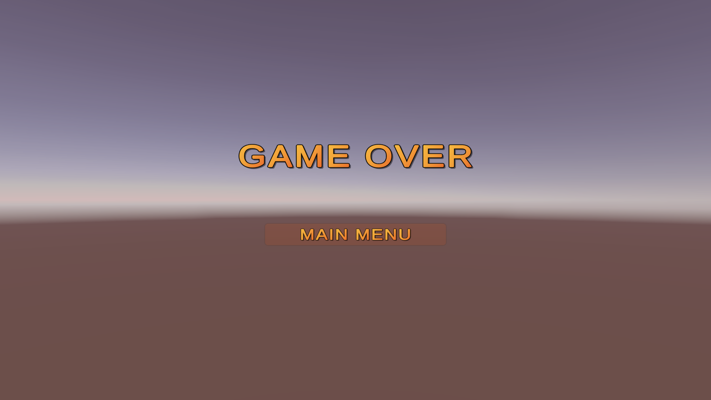
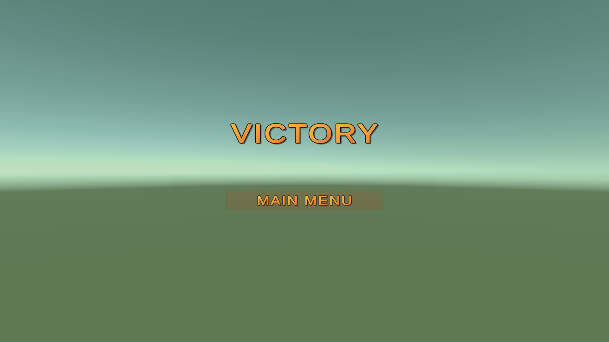
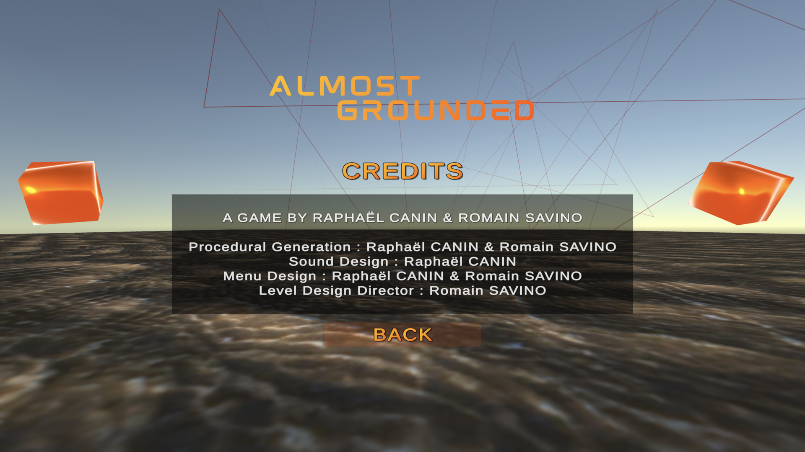
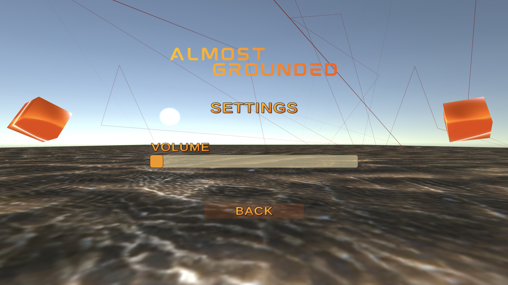

### Tutorial Screenshots

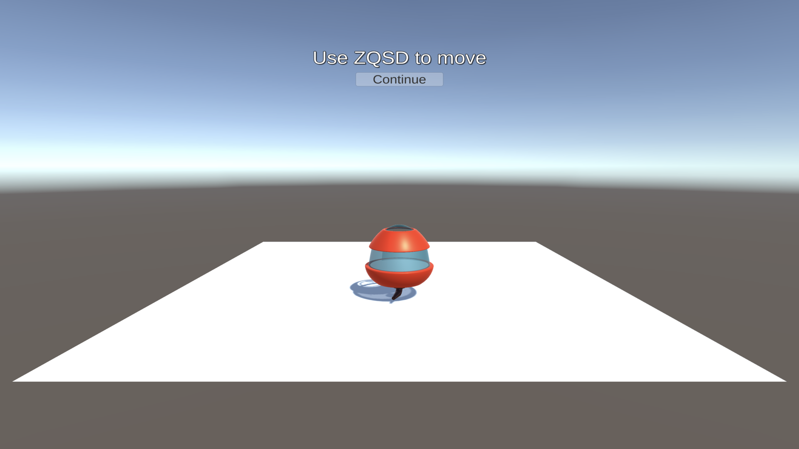
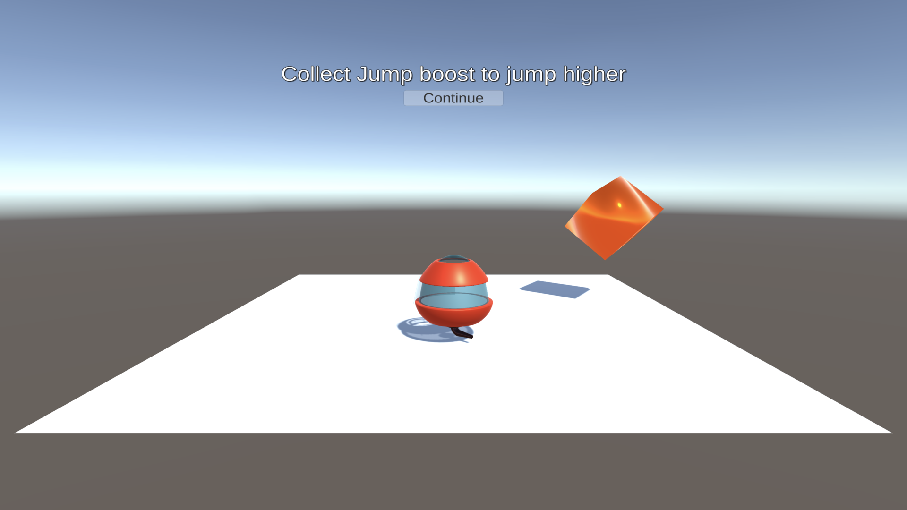
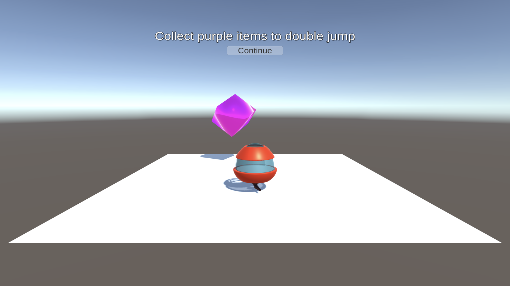

```

```
